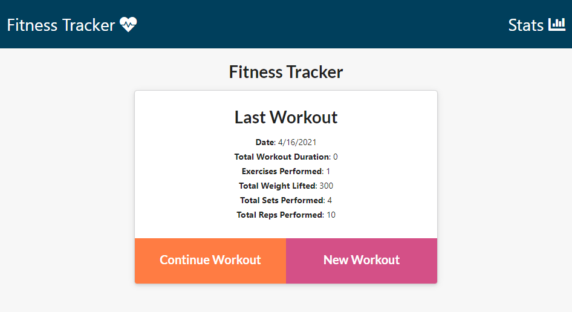
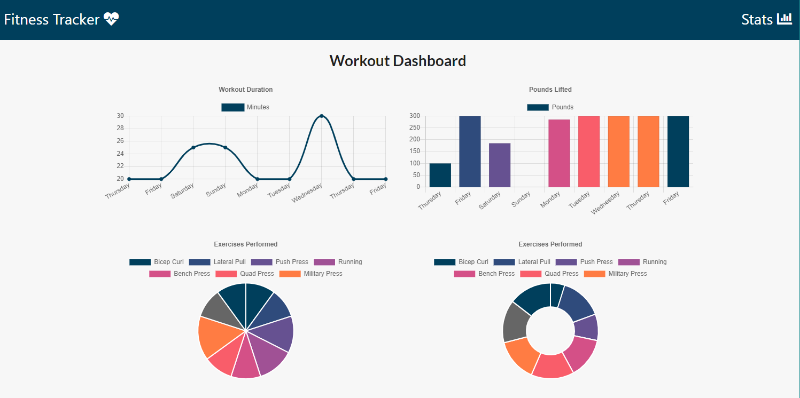
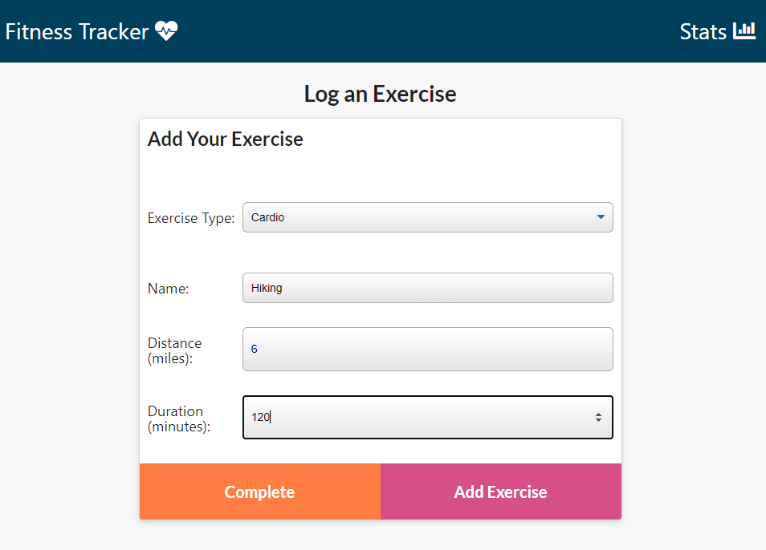
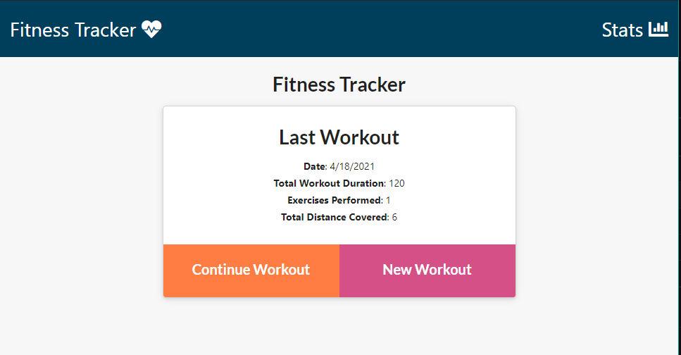

# fitness-witness
An app to track workouts and progress

## Acceptance Criteria

When the user loads the page, they should be given the option to create a new workout or continue with their last workout.

To deploy an application with a MongoDB database to Heroku, you'll need to set up a MongoDB Atlas account and connect a database from there to your application. Be sure to use the following guides for support:

  * [Set Up MongoDB Atlas]

  * [Deploy with Heroku and MongoDB Atlas]

## Submission on BCS

You are required to submit the following:

* The URL to the deployed application

* The URL to the GitHub repository

